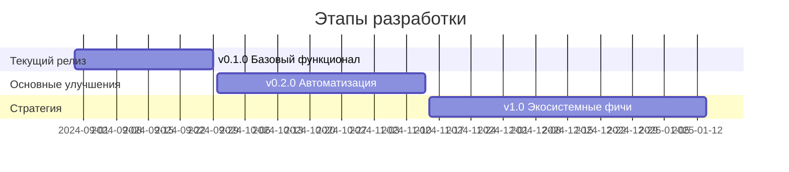

# Scrum Assistant for 1C 

Расширение для интеграции 1С с Битрикс24 и управления Scrum-процессами.  
**Актуальная версия:** 0.0.0.1  
**Требования:** 
- 1С:Предприятие 8.3.24+
- [OpenIntegrations 1.26.0+](https://github.com/Bayselonarrend/OpenIntegrations)
- REST API Битрикс24 (OAuth 2.0)

## 🚧 Roadmap & TODO

### 🚧 Текущие цели (v0.0.1)
**Основной функционал**
- [ ] Програмное составление формы
- [ ] Переключение между спринтами
- [ ] Форма настроек
- [x] Сохранение настроек
- [ ] Базовые отборы и сортировка задач
- [ ] Отображение тэгов, эпиков и авторов
- [ ] Тестирование и логирование

### ⚡️ Ближайший релиз (v0.1.0)
**Основной функционал**
- [ ] Регламентные операции (автообновление статусов)
- [ ] Создание/удаление задач из интерфейса 1С
- [x] Кэширование данных (оптимизация производительности)
- [ ] Сохранение файлов в задачах
- [ ] Базовые отборы и сортировка задач

**Интеграции**
- [ ] Превышение времени задачи (оповещения)
- [ ] Telegram-уведомления для ключевых событий

### 🌟 Планируемые улучшения (v0.2.0)
**Автоматизация**
- [ ] Умные шаблоны задач (автозаполнение полей)
- [ ] Авто-генерация ежедневных стендап-отчетов
- [ ] Resource allocation map (визуализация загрузки)

**Аналитика**
- [ ] Визуализация прогресса спринта (графики)
- [ ] Сравнение KPI с предыдущими спринтами
- [ ] Индекс стабильности спринта

**Интеграции+**
- [ ] Обратная синхронизация (Bitrix24 → 1С)
- [ ] Webhook-обработчик для событий Bitrix24
- [ ] Интеграция с MkDocs для документации

### 🚀 Стратегические фичи (v1.0)
- [ ] Голосовой ассистент через Telegram
- [ ] AI-прогнозирование рисков срывов сроков
- [ ] Jira/Trello коннектор (мультиплатформенность)
- [ ] Система геймификации (баллы за задачи)
- [ ] Drag-and-drop доска задач в интерфейсе 1С

### 🛠 Технические улучшения
- [ ] Модуль юнит-тестирования
- [ ] Расширенное API (GraphQL поддержка)
- [ ] История изменений задач с возможностью отката
- [ ] Авто-генерация changelog из задач

### ✅ Легенда статусов
- `[x]` Завершено 
- `[🚧]` В процессе разработки
- `[ ]` В планах
- `[NEW]` Новое предложение
